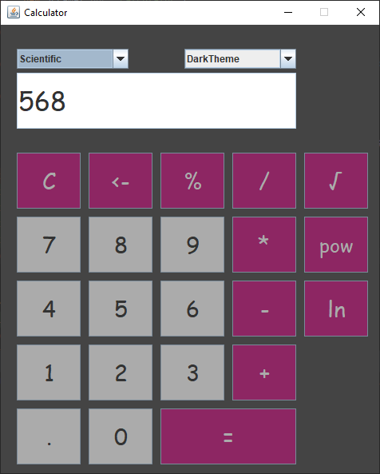
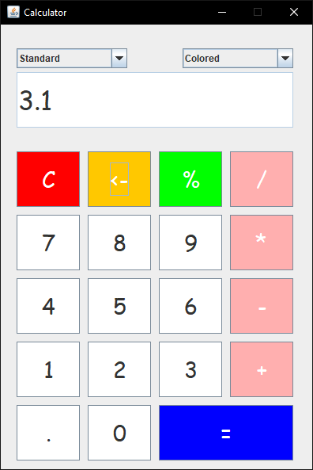

# Calculator App
A very basic calculator application created with Java **Swing**. 

## Thank You!
Please ⭐️ this repo and share it with others

### Screenshots
Scientific / Dark |  Standard / Colored
:------------------:|:-------------------
 | 

### Requirements 🔧
* Java version 8 or higher.

